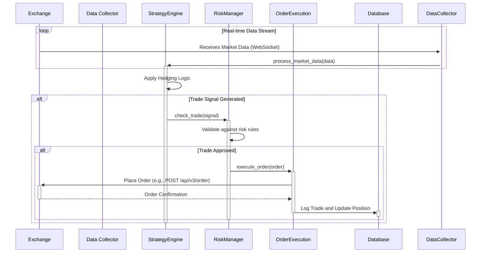

# HyperTrader Hedging Strategy Architecture Document

## 1. Introduction

This document outlines the overall project architecture for the **HyperTrader Hedging Strategy**, a fully automated, event-driven trading bot. Its primary goal is to serve as the guiding architectural blueprint for AI-driven development, ensuring consistency and adherence to the chosen patterns and technologies defined herein. This architecture is derived directly from the requirements specified in the (assumed) PRD v1.0 and the Advanced Hedging Strategy v6.0.0 document.

### 1.1. Starter Template or Existing Project

Based on the PRD, this is a greenfield project. There is no existing codebase or starter template. The architecture will be designed from scratch using the specified Python technology stack.

### 1.2. Change Log

| Date       | Version | Description                 | Author    |
|------------|---------|-----------------------------|-----------|
| 2024-05-21 | 1.0     | Initial architectural draft | Architect |

## 2. High-Level Architecture

### 2.1. Technical Summary

The system is designed as a modular, single-process, in-memory application. It will consist of several core components responsible for data ingestion, strategy execution, order management, and risk monitoring. These components will communicate directly within the application's memory. All state, such as current positions and trade history, will be held in-memory and will not be persisted between application restarts. The entire application will be containerized using Docker for consistent deployment.

### 2.2. High-Level Overview

The core of the system is a Python-based application designed for continuous, automated trading. It will connect to cryptocurrency exchanges via their APIs to receive market data and execute trades. The architecture is designed to be robust against network interruptions and API failures, with a strong emphasis on logging, monitoring, and risk management.

### 2.3. High-Level Project Diagram

```mermaid
graph TD;
    subgraph "External Services"
        A[Exchange APIs/WebSockets]
    end

    subgraph "HyperTrader Application (In-Memory)"
        B[Data Collector] --> D[Strategy Engine];
        D --> E[Risk Manager];
        E --> F[Order Execution];
        F --> A;

         subgraph "Shared Services"
            H[Logging Service]
            I[Configuration Manager]
         end
        B --> H;
        D --> H;
       E --> H;
        F --> H;
        B & D & E & F --> I;
    end

    subgraph "User Interface (Optional)"
        J[Web UI / CLI] --> K[API Gateway (FastAPI)];
        K --> E; # Connect to Risk Manager for state
    end
```

### 2.4. Architectural and Design Patterns

- **Modular Design:** The application is broken down into distinct, single-responsibility components (Data Collector, Strategy Engine, etc.) that can be developed and tested independently.
- **Repository Pattern:** Database interactions will be abstracted through a repository layer. This makes the core logic independent of the database technology and simplifies testing.
- **Dependency Injection:** Dependencies (like database connections or API clients) will be injected into components, making the system more modular and testable.

## 3. Tech Stack

This table represents the proposed technology stack. All choices are aimed at providing a robust, high-performance, and maintainable system.

| Category | Technology | Version | Purpose | Rationale |
|---|---|---|---|---|
| **Language** | Python | 3.10+ | Core application logic | Strong data science ecosystem, excellent library support for finance and APIs. |
| **Backend Framework** | FastAPI | latest | Optional: For creating a REST API for monitoring/control | High performance, modern, easy to use, and has automatic OpenAPI documentation. |
| **Data & Numerics** | NumPy / Pandas | latest | Data manipulation and analysis | Industry standard for numerical and time-series data analysis in Python. |
| **Exchange-Connectivity** | CCXT | latest | Standardized API access to hundreds of crypto exchanges | Provides a unified interface for interacting with different exchanges, simplifying order management and data fetching. |
| **Database** | PostgreSQL | 15+ | Long-term storage for trades, configurations, and historical data | Robust, reliable, and excellent support for complex queries and data types. |
| **CI/CD** | GitHub Actions | - | Automated testing and deployment pipeline | Tightly integrated with GitHub, easy to configure for a Python project. |

## 4. Data Models

### 4.1. `Trade`
- **Purpose:** Represents an executed trade on an exchange.
- **Key Attributes:**
  - `id`: Unique identifier for the trade.
  - `timestamp`: Time of the trade.
  - `symbol`: The trading pair (e.g., 'BTC/USDT').
  - `side`: 'buy' or 'sell'.
  - `price`: Execution price.
  - `amount`: Quantity of the base asset traded.
  - `cost`: Total cost of the trade (price * amount).
  - `fee`: Fee paid for the trade.

### 4.2. `Order`
- **Purpose:** Represents an order placed on an exchange.
- **Key Attributes:**
  - `id`: Unique identifier for the order.
  - `exchange_order_id`: The ID assigned by the exchange.
  - `symbol`: The trading pair.
  - `type`: 'limit', 'market', etc.
  - `side`: 'buy' or 'sell'.
  - `amount`: The quantity ordered.
  - `price`: The price for limit orders.
  - `status`: 'open', 'closed', 'canceled'.

### 4.3. `Position`
- **Purpose:** Represents the current holding of an asset.
- **Key Attributes:**
  - `symbol`: The asset (e.g., 'BTC').
  - `amount`: The total quantity held.
  - `average_entry_price`: The weighted average price of the position.

## 5. Components

### 5.1. Data Collector
- **Responsibility:** Connects to exchange WebSocket/REST APIs to stream and store real-time market data (trades, order books, tickers).
- **Key Interfaces:** Passes market data objects directly to the Strategy Engine.
- **Dependencies:** CCXT, Strategy Engine.

### 5.2. Strategy Engine
- **Responsibility:** Receives market data from the Data Collector. Applies the hedging logic defined in the "Advanced Hedging Strategy v6.0.0" document. Generates trading signals (e.g., "buy 0.1 BTC at market").
- **Key Interfaces:** Receives market data objects, and if a trade is warranted, passes a trade signal object to the Risk Manager.
- **Dependencies:** NumPy, Pandas, Risk Manager.

### 5.3. Risk Manager
- **Responsibility:** Receives trade signals from the Strategy Engine. Before execution, it checks them against pre-defined risk rules (e.g., max position size, daily loss limit). It can veto a trade if it violates rules.
- **Key Interfaces:** Receives trade signal objects, and if approved, passes an order object to the Order Execution Engine.
- **Dependencies:** PostgreSQL (for position data), Order Execution Engine.

### 5.4. Order Execution Engine
- **Responsibility:** Receives approved order objects from the Risk Manager. Places, monitors, and manages orders on the exchange via the API.
- **Key Interfaces:** Receives order objects, interacts with the Exchange API, and updates the database with the results of the trade execution.
- **Dependencies:** CCXT, PostgreSQL.

### 5.5. Persistence Service
- **Responsibility:** A set of data access objects (DAOs) or a repository layer that handles all interactions with the PostgreSQL database.
- **Key Interfaces:** Provides methods like `save_trade()`, `get_position()`, `update_order_status()`.
- **Dependencies:** SQLAlchemy, psycopg2.

## 6. External APIs

The system will primarily interact with Cryptocurrency Exchange APIs. The `ccxt` library will be used to abstract the differences between them.

- **Binance API:**
  - **Purpose:** Real-time market data, order execution, account management.
  - **Documentation:** https://binance-docs.github.io/apidocs/spot/en/
  - **Authentication:** API Key and Secret.
- **Kraken API:**
  - **Purpose:** Real-time market data, order execution, account management.
  - **Documentation:** https://docs.kraken.com/rest/
  - **Authentication:** API Key and Secret.
- **(Other exchanges as required by the strategy)**

## 7. Core Workflows

### Hedge Execution Flow

This diagram illustrates the sequence of events from receiving a market update to executing a hedge trade.



## 8. Source Tree

A proposed project structure to promote modularity and separation of concerns.

```
hypertrader/
├── .github/
│   └── workflows/
│       └── ci.yml
├── config/
│   ├── __init__.py
│   └── settings.py         # Application configuration (env vars, etc.)
├── docs/
│   ├── architecture.md
│   └── prd.md
├── src/
│   ├── __init__.py
│   ├── main.py               # Main application entry point
│   ├── core/                 # Core components and business logic
│   │   ├── __init__.py
│   │   ├── engine.py         # Main event loop and service orchestration
│   │   ├── models.py         # Pydantic/SQLAlchemy data models
│   │   └── enums.py          # Enumerations (e.g., OrderSide, OrderStatus)
│   ├── services/             # Individual service implementations
│   │   ├── __init__.py
│   │   ├── base_service.py   # Abstract base class for services
│   │   ├── data_collector.py # Exchange data ingestion service
│   │   ├── strategy_engine.py  # Trading strategy logic
│   │   ├── risk_manager.py     # Risk management service
│   │   └── order_executor.py   # Order execution service
│   ├── connectors/           # Connectors to external systems
│   │   ├── __init__.py
│   │   ├── exchange.py       # Wrapper around CCXT for exchange interaction
│   │   └── database.py       # Database connection and session management
│   └── utils/                # Shared utility functions
│       ├── __init__.py
│       └── logging_config.py # Logging setup
├── tests/
│   ├── __init__.py
│   ├── conftest.py           # Pytest fixtures
│   ├── integration/
│   └── unit/
├── .dockerignore
├── .gitignore
├── docker-compose.yml
├── Dockerfile
└── requirements.txt
```

## 9. Infrastructure and Deployment

### 9.1. Infrastructure as Code (IaC)

While not required for the initial version, infrastructure will be managed using Terraform if the project scales to a cloud environment. For now, `docker-compose.yml` will define the local development environment.

### 9.2. Deployment Strategy

- **Strategy:** The application will be packaged as a Docker container.
- **CI/CD Platform:** GitHub Actions will be used to run tests on every push and build the Docker image.
- **Deployment:** Manual deployment of the Docker container to a Virtual Private Server (VPS) or a cloud VM (e.g., AWS EC2) is sufficient for the initial phase.

### 9.3. Environments

- **Development:** Local machine using `docker-compose`.
- **Staging:** A dedicated VPS mirroring the production setup for end-to-end testing with paper trading accounts.
- **Production:** A dedicated, secure VPS or cloud instance with high availability.

## 10. Error Handling and Logging

- **General Approach:** A centralized logging configuration will be used. All logs will be written to `stdout` to be captured by Docker's logging driver and will also be written to a rotating file log.
- **Logging Format:** Logs will be structured (JSON format) to include a timestamp, log level, service name, and a detailed message.
- **Error Handling:**
  - **API Errors:** The exchange connector will handle transient errors (e.g., network issues, rate limits) with an exponential backoff retry mechanism.
  - **Critical Errors:** In case of critical failures (e.g., loss of connectivity, repeated API errors), the system will enter a "safe mode," cancel all open orders, and send an alert.

## 11. Coding Standards

- **Style:** Code will adhere to **PEP 8** standards, enforced by `black` and `flake8` linters.
- **Typing:** All function signatures and variables will use Python's type hints to improve code clarity and allow for static analysis.
- **Docstrings:** All modules, classes, and functions will have Google-style docstrings.
- **Configuration:** No hardcoded values. All configuration (API keys, strategy parameters) will be managed via environment variables or a configuration file.

## 12. Test Strategy and Standards

- **Unit Tests:** `pytest` will be used to test individual functions and classes in isolation. Mocks will be used for external dependencies (e.g., exchange APIs, databases).
- **Integration Tests:** Tests will cover the interaction between different components (e.g., ensuring a signal from the Strategy Engine correctly creates an order in the Order Execution service). These will run against a local PostgreSQL and Redis instance managed by Docker Compose.
- **Backtesting:** A dedicated backtesting framework will be developed to test strategy performance against historical market data. This is critical for validating the strategy's effectiveness before live deployment.

## 13. Security

- **API Key Management:** API keys and secrets will **NEVER** be committed to the repository. They will be loaded from environment variables or a secure vault service (like HashiCorp Vault or AWS Secrets Manager) in production.
- **Network Security:** The production server will be firewalled to only allow traffic from necessary IP addresses (e.g., the exchange's API servers).
- **Dependency Management:** `pip-tools` will be used to pin dependencies to specific versions to prevent supply-chain attacks. A tool like `safety` or `pip-audit` will be used in the CI/CD pipeline to scan for known vulnerabilities.

## 14. Next Steps

- **Product Owner Review:** The Product Owner should review this document to ensure it aligns with the business requirements outlined in the PRD.
- **Story Creation:** The Scrum Master can now begin creating user stories based on the components and workflows defined here, starting with the foundational elements like project setup, configuration management, and data collection.
- **Developer Handoff:** The development team can begin setting up the project structure, CI/CD pipeline, and implementing the core services.
