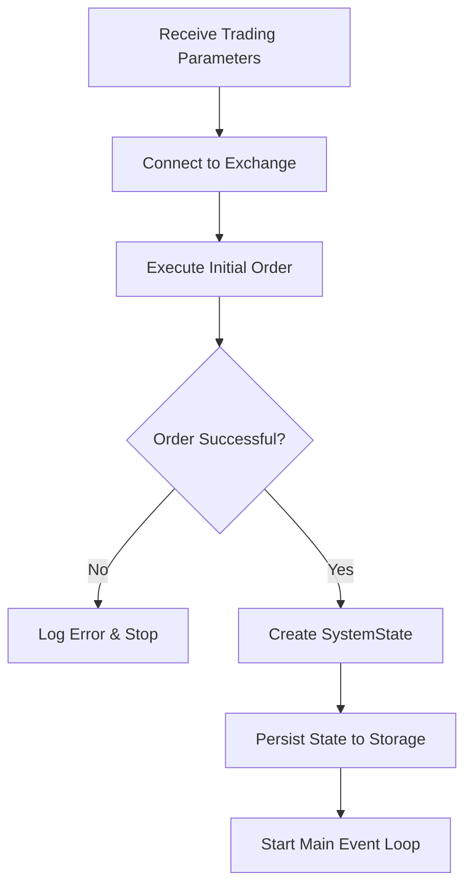
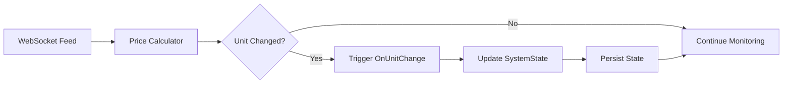
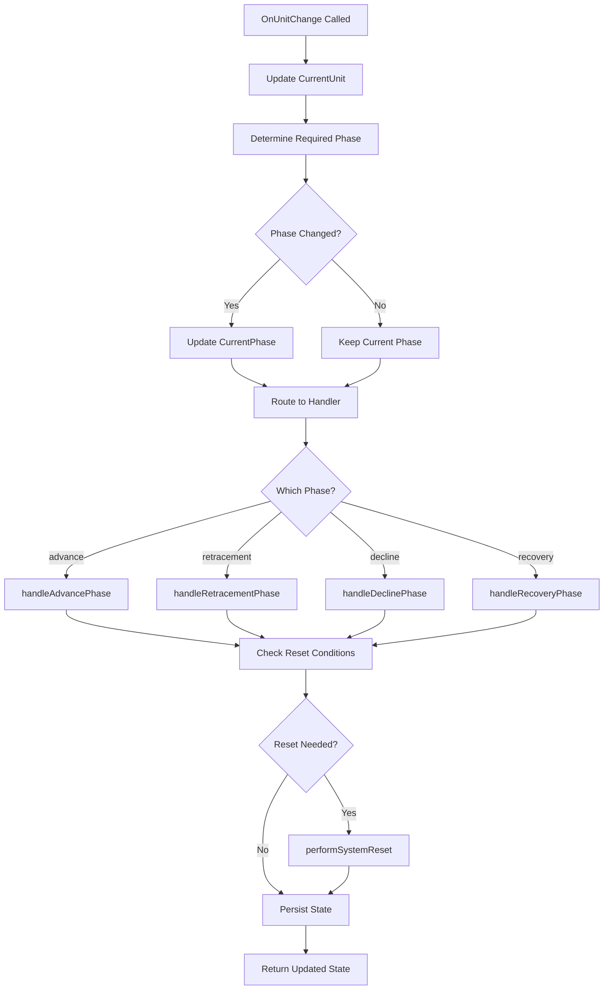
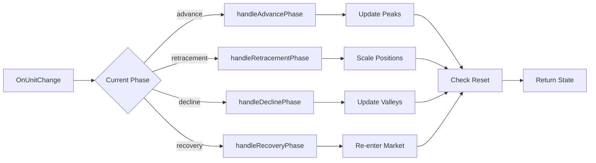

# HyperTrader - Language Agnostic Implementation Plan

> **Universal implementation guide for the HyperTrader trading system**

This document provides a language-agnostic foundation for implementing the HyperTrader system in any programming language, with specific implementation notes for Python and Go.

---

## 📋 Table of Contents

- [1. Core Data Structure: The SystemState](#1-core-data-structure-the-systemstate)
- [2. Initialization: The Entry Point](#2-initialization-the-entry-point)
- [3. The Main Loop: Real-Time Monitoring](#3-the-main-loop-real-time-monitoring)
- [4. The Central Handler: OnUnitChange](#4-the-central-handler-onunitchange)
- [5. Logic Handlers & System Reset](#5-logic-handlers--system-reset)
- [6. Critical Implementation Details](#6-critical-implementation-details)

---

## 1. Core Data Structure: The SystemState

### Overview

The SystemState is the central data structure that maintains all information about a single trading plan. This object serves as the single source of truth for the trading system's current state and must be created upon entry and updated after every action.

### SystemState Schema

> ⚠️ **Critical Requirement**: All price and dollar amount fields must use high-precision decimal types to avoid floating-point arithmetic errors.

### Field Definitions
| Field | Type | Description |
|-------|------|-------------|
| `Symbol` | string | The trading pair, e.g., "BTC/USDT" |
| `CurrentPhase` | string | 'advance', 'retracement', 'decline', or 'recovery' |
| `EntryPrice` | high-precision decimal | The initial average fill price |
| `UnitValue` | high-precision decimal | The dollar value of one unit of price movement |
| `PeakPrice` | high-precision decimal | The highest price reached since the last reset |
| `ValleyPrice` | high-precision decimal | The lowest price reached since the last reset |
| `CurrentUnit` | integer | The current unit relative to the EntryPrice |
| `PeakUnit` | integer | The highest unit reached. Can be null |
| `ValleyUnit` | integer | The lowest unit reached. Can be null |
| `LongInvested` | high-precision decimal | The dollar amount in the long allocation's long position |
| `LongCash` | high-precision decimal | The dollar amount held as cash by the long allocation |
| `HedgeLong` | high-precision decimal | The dollar amount in the hedge allocation's long position |
| `HedgeShort` | high-precision decimal | The dollar amount in the hedge allocation's short position |
| `InitialMargin` | high-precision decimal | The total margin used to enter the trade |

## 2. Initialization: The Entry Point

### Overview

The initialization process establishes a new trading plan and begins real-time monitoring. This is a critical phase that sets up all necessary components for successful trading.

### Initialization Workflow



### Implementation Steps

#### Step 1: Input Validation
**Receive and validate trading parameters:**

| Parameter | Type | Description | Validation |
|-----------|------|-------------|------------|
| `symbol` | string | Trading pair (e.g., "BTC/USDT") | Must be valid exchange pair |
| `margin` | decimal | Initial margin amount | Must be > 0 |
| `leverage` | integer | Trading leverage | Must be within exchange limits |
| `api_key` | string | Exchange API key | Must be valid and authorized |
| `secret` | string | Exchange API secret | Must match api_key |

#### Step 2: Exchange Connection
**Initialize exchange connection with proper configuration:**

```python
# Python Example
import ccxt

exchange = ccxt.hyperliquid({
    'apiKey': api_key,
    'secret': secret,
    'enableRateLimit': True,  # CRITICAL: Prevents rate limiting
    'timeout': 30000,         # 30 second timeout
    'sandbox': False          # Use live trading
})
```

```go
// Go Example
package main

type ExchangeConfig struct {
    APIKey         string
    Secret         string
    EnableRateLimit bool
    Timeout        time.Duration
}
```

#### Step 3: Initial Order Execution
**Place the initial market buy order:**

```python
# Python Implementation
try:
    order = await exchange.create_market_buy_order(
        symbol=symbol,
        amount=calculate_position_size(margin, leverage),
    )
    
    # Wait for order confirmation
    while order['status'] == 'pending':
        await asyncio.sleep(0.1)
        order = await exchange.fetch_order(order['id'], symbol)
        
except Exception as e:
    logger.error(f"Order execution failed: {e}")
    return None
```

#### Step 4: SystemState Creation
**Initialize the SystemState object:**

```python
def create_initial_system_state(order_result: dict, symbol: str) -> SystemState:
    entry_price = Decimal(str(order_result['average']))
    initial_margin = Decimal(str(order_result['cost']))
    
    # Calculate unit value (5% of margin at given leverage)
    unit_value = initial_margin * Decimal('0.05')
    
    return SystemState(
        symbol=symbol,
        current_phase='advance',
        entry_price=entry_price,
        unit_value=unit_value,
        current_unit=0,
        peak_unit=0,
        valley_unit=None,
        long_invested=initial_margin / 2,
        long_cash=Decimal('0'),
        hedge_long=initial_margin / 2,
        hedge_short=Decimal('0'),
        initial_margin=initial_margin
    )
```

#### Step 5: State Persistence
**Save state to persistent storage:**

| Storage Option | Pros | Cons | Use Case |
|----------------|------|------|----------|
| **Database** | ACID, scalable, queryable | Complex setup | Production |
| **JSON File** | Simple, readable | Not concurrent-safe | Development |
| **Redis** | Fast, atomic operations | Memory-based | High-frequency |

#### Step 6: Event Loop Startup
**Hand off to the main monitoring loop:**

```python
async def start_trading_system(system_state: SystemState):
    # Save initial state
    await persist_state(system_state)
    
    # Start main event loop
    await main_trading_loop(system_state)
```

## 3. The Main Loop: Real-Time Monitoring

### Overview

The main loop is the heart of the trading system, continuously monitoring price changes and triggering trading logic. This component implements real-time price monitoring with efficient event-driven architecture.

### Architecture Pattern



### Core Algorithm

#### Universal Logic Flow

1. **Establish WebSocket Connection**
   ```
   ws_url = "wss://api.exchange.com/ws/ticker/{symbol}"
   connection = establish_websocket(ws_url)
   ```

2. **Price Processing Loop**
   ```
   for each price_update in websocket_stream:
       new_current_unit = calculate_unit(price_update, entry_price, unit_value)
       
       if int(new_current_unit) != system_state.current_unit:
           system_state.current_unit = int(new_current_unit)
           system_state = OnUnitChange(system_state)
           persist_state(system_state)
   ```

3. **Unit Calculation Formula**
   ```
   currentUnit = (currentPrice - entryPrice) / unitValue
   ```

### Language-Specific Implementations

#### Python Implementation (AsyncIO)

```python
import asyncio
import websockets
import json
from decimal import Decimal

async def main_trading_loop(system_state: SystemState):
    """Main event loop using Python asyncio"""
    
    uri = f"wss://api.hyperliquid.xyz/ws/ticker/{system_state.symbol}"
    
    async with websockets.connect(uri) as websocket:
        await websocket.send(json.dumps({
            "method": "subscribe",
            "params": [f"ticker.{system_state.symbol}"]
        }))
        
        async for message in websocket:
            try:
                data = json.loads(message)
                current_price = Decimal(str(data['price']))
                
                # Calculate new unit position
                new_unit = int(
                    (current_price - system_state.entry_price) / 
                    system_state.unit_value
                )
                
                # Check for unit change
                if new_unit != system_state.current_unit:
                    logger.info(
                        f"Unit change detected: {system_state.current_unit} -> {new_unit}"
                    )
                    
                    system_state.current_unit = new_unit
                    system_state = await OnUnitChange(system_state)
                    await persist_state(system_state)
                    
            except Exception as e:
                logger.error(f"Error processing price update: {e}")
                await asyncio.sleep(1)  # Brief pause before retry
```

**Python Benefits:**
- Single-threaded event loop
- Built-in async/await syntax
- Excellent WebSocket libraries
- Easy exception handling

#### Go Implementation (Goroutines & Channels)

```go
package main

import (
    "context"
    "encoding/json"
    "log"
    "time"
    
    "github.com/gorilla/websocket"
    "github.com/shopspring/decimal"
)

type PriceUpdate struct {
    Symbol string          `json:"symbol"`
    Price  decimal.Decimal `json:"price"`
    Time   time.Time       `json:"timestamp"`
}

func MainTradingLoop(ctx context.Context, initialState SystemState) error {
    // Channel for price updates
    priceChannel := make(chan PriceUpdate, 100)
    
    // Start WebSocket goroutine
    go func() {
        defer close(priceChannel)
        if err := websocketListener(ctx, initialState.Symbol, priceChannel); err != nil {
            log.Printf("WebSocket error: %v", err)
        }
    }()
    
    // Main processing loop
    systemState := initialState
    
    for {
        select {
        case priceUpdate, ok := <-priceChannel:
            if !ok {
                return fmt.Errorf("price channel closed")
            }
            
            // Calculate new unit
            priceDiff := priceUpdate.Price.Sub(systemState.EntryPrice)
            newUnit := priceDiff.Div(systemState.UnitValue).IntPart()
            
            if newUnit != systemState.CurrentUnit {
                log.Printf("Unit change: %d -> %d", systemState.CurrentUnit, newUnit)
                
                systemState.CurrentUnit = newUnit
                updatedState, err := OnUnitChange(systemState)
                if err != nil {
                    log.Printf("OnUnitChange error: %v", err)
                    continue
                }
                
                systemState = updatedState
                if err := PersistState(systemState); err != nil {
                    log.Printf("Persist error: %v", err)
                }
            }
            
        case <-ctx.Done():
            return ctx.Err()
        }
    }
}

func websocketListener(ctx context.Context, symbol string, priceChannel chan<- PriceUpdate) error {
    url := fmt.Sprintf("wss://api.hyperliquid.xyz/ws/ticker/%s", symbol)
    
    conn, _, err := websocket.DefaultDialer.Dial(url, nil)
    if err != nil {
        return err
    }
    defer conn.Close()
    
    // Subscribe to ticker
    subscribeMsg := map[string]interface{}{
        "method": "subscribe",
        "params": []string{fmt.Sprintf("ticker.%s", symbol)},
    }
    
    if err := conn.WriteJSON(subscribeMsg); err != nil {
        return err
    }
    
    for {
        select {
        case <-ctx.Done():
            return ctx.Err()
        default:
            var message json.RawMessage
            if err := conn.ReadJSON(&message); err != nil {
                return err
            }
            
            var priceUpdate PriceUpdate
            if err := json.Unmarshal(message, &priceUpdate); err != nil {
                log.Printf("JSON unmarshal error: %v", err)
                continue
            }
            
            select {
            case priceChannel <- priceUpdate:
            case <-ctx.Done():
                return ctx.Err()
            }
        }
    }
}
```

**Go Benefits:**
- True concurrency with goroutines
- Channel-based communication
- Superior performance for I/O intensive tasks
- Built-in context cancellation
- Excellent for high-frequency trading

### Performance Considerations

#### Latency Optimization

| Language | Typical Latency | Memory Usage | CPU Usage |
|----------|-----------------|---------------|----------|
| **Python** | 10-50ms | Higher | Moderate |
| **Go** | 1-10ms | Lower | Efficient |
| **Rust** | <1-5ms | Lowest | Most Efficient |
| **Node.js** | 5-20ms | Moderate | Moderate |

#### Error Handling Strategies

```python
# Python: Exception-based error handling
try:
    result = await risky_operation()
except ExchangeError as e:
    logger.error(f"Exchange error: {e}")
    await handle_exchange_error(e)
except NetworkError as e:
    logger.warning(f"Network error: {e}")
    await reconnect_websocket()
```

```go
// Go: Explicit error return values
result, err := riskyOperation()
if err != nil {
    switch err := err.(type) {
    case *ExchangeError:
        log.Printf("Exchange error: %v", err)
        handleExchangeError(err)
    case *NetworkError:
        log.Printf("Network error: %v", err)
        reconnectWebSocket()
    default:
        return fmt.Errorf("unexpected error: %w", err)
    }
}
```

## 4. The Central Handler: OnUnitChange

### Overview

The `OnUnitChange` function serves as the central traffic controller for the trading system. It orchestrates phase transitions, delegates to appropriate handlers, and manages the overall system state flow.

### Decision Flow



### Implementation

#### Core Function Structure

```python
def OnUnitChange(state: SystemState) -> SystemState:
    """
    Central handler that processes unit changes and routes to appropriate phase handlers.
    
    Args:
        state: Current SystemState object
        
    Returns:
        Updated SystemState after processing
    """
    
    # Step 1: Current unit is already updated by caller
    logger.info(f"Processing unit change to {state.current_unit}")
    
    # Step 2: Determine required phase
    required_phase = determine_phase(state)
    
    # Step 3: Update phase if needed
    if required_phase != state.current_phase:
        logger.info(f"Phase transition: {state.current_phase} -> {required_phase}")
        state.current_phase = required_phase
    
    # Step 4: Route to appropriate handler
    if state.current_phase == 'advance':
        state = handleAdvancePhase(state)
    elif state.current_phase == 'retracement':
        state = handleRetracementPhase(state)
    elif state.current_phase == 'decline':
        state = handleDeclinePhase(state)
    elif state.current_phase == 'recovery':
        state = handleRecoveryPhase(state)
    else:
        raise ValueError(f"Unknown phase: {state.current_phase}")
    
    # Step 5: Check for system reset conditions
    if should_reset_system(state):
        logger.info("System reset conditions met")
        state = performSystemReset(state)
    
    # Step 6: State persistence handled by caller
    return state
```

#### Phase Determination Logic

```python
def determine_phase(state: SystemState) -> str:
    """
    Determines the required trading phase based on current system state.
    
    Phase Logic:
    - ADVANCE: Both allocations long, tracking peaks
    - RETRACEMENT: Decline from peak with scaling logic
    - DECLINE: Long fully cashed, hedge fully short
    - RECOVERY: Recovery from valley with re-entry logic
    """
    
    # Check allocation states
    long_fully_cash = (state.long_invested == 0 and state.long_cash > 0)
    hedge_fully_short = (state.hedge_long == 0 and state.hedge_short > 0)
    both_fully_long = (state.long_invested > 0 and state.hedge_long > 0 and 
                      state.hedge_short == 0)
    
    # Phase determination matrix
    if long_fully_cash and hedge_fully_short:
        return 'decline'
    elif both_fully_long:
        return 'advance'
    elif state.peak_unit is not None and state.current_unit < state.peak_unit:
        return 'retracement'
    elif state.valley_unit is not None and state.current_unit > state.valley_unit:
        return 'recovery'
    else:
        # Default to current phase if unclear
        return state.current_phase
```

#### Reset Condition Checker

```python
def should_reset_system(state: SystemState) -> bool:
    """
    Determines if system reset conditions are met.
    
    Reset triggers when:
    - longCash = 0 (no cash positions)
    - hedgeShort = 0 (no short positions)
    """
    return (state.long_cash == 0 and state.hedge_short == 0)
```

### Handler Responsibilities

#### Handler Interface

```python
from abc import ABC, abstractmethod

class PhaseHandler(ABC):
    @abstractmethod
    def handle(self, state: SystemState) -> SystemState:
        """Process the given state for this phase"""
        pass
    
    @abstractmethod
    def get_phase_name(self) -> str:
        """Return the phase name this handler manages"""
        pass
```

#### Handler Dispatch Table

| Phase | Handler Function | Primary Responsibility |
|-------|------------------|------------------------|
| **advance** | `handleAdvancePhase()` | Track peaks, maintain long positions |
| **retracement** | `handleRetracementPhase()` | Scale positions during decline |
| **decline** | `handleDeclinePhase()` | Track valleys, maintain short positions |
| **recovery** | `handleRecoveryPhase()` | Scale positions during recovery |

### Error Handling

```python
def OnUnitChange(state: SystemState) -> SystemState:
    try:
        # Main processing logic...
        return process_unit_change(state)
        
    except ExchangeError as e:
        logger.error(f"Exchange error in OnUnitChange: {e}")
        # Don't update state if exchange operations fail
        return state
        
    except ValidationError as e:
        logger.error(f"State validation error: {e}")
        # Attempt to recover or halt system
        raise SystemHaltError(f"Invalid state detected: {e}")
        
    except Exception as e:
        logger.critical(f"Unexpected error in OnUnitChange: {e}")
        # Log full stack trace and halt
        raise SystemHaltError(f"Critical error: {e}")
```

### Performance Monitoring

```python
import time
from functools import wraps

def monitor_performance(func):
    @wraps(func)
    def wrapper(*args, **kwargs):
        start_time = time.perf_counter()
        result = func(*args, **kwargs)
        end_time = time.perf_counter()
        
        execution_time = end_time - start_time
        logger.info(f"{func.__name__} executed in {execution_time:.4f}s")
        
        # Alert if processing takes too long
        if execution_time > 0.5:  # 500ms threshold
            logger.warning(f"Slow execution detected: {execution_time:.4f}s")
            
        return result
    return wrapper

@monitor_performance
def OnUnitChange(state: SystemState) -> SystemState:
    # Implementation...
    pass
```

## 5. Logic Handlers & System Reset

### Overview

The phase handlers contain the core trading logic, implementing the four-phase system with precise position management and trade execution. Each handler is responsible for a specific market condition and allocation strategy.

### Handler Architecture



### Phase Handlers

#### 1. Advance Phase Handler

**Purpose**: Track price peaks and maintain long positions during upward movements.

```python
def handleAdvancePhase(state: SystemState) -> SystemState:
    """
    Handle the advance phase: both allocations long, tracking peaks.
    
    Responsibilities:
    - Update peak tracking when new highs are reached
    - Maintain long positions
    - No trading activity (holding pattern)
    """
    
    # Update peak tracking if new peak reached
    if state.peak_unit is None or state.current_unit > state.peak_unit:
        state.peak_unit = state.current_unit
        state.peak_price = calculate_price_from_unit(
            state.current_unit, state.entry_price, state.unit_value
        )
        
        logger.info(
            f"New peak reached - Unit: {state.peak_unit}, "
            f"Price: {state.peak_price}"
        )
    
    # Verify allocation states
    assert state.long_invested > 0, "Long allocation must be invested in advance phase"
    assert state.hedge_long > 0, "Hedge allocation must be long in advance phase"
    assert state.hedge_short == 0, "No short positions allowed in advance phase"
    
    return state
```

#### 2. Retracement Phase Handler

**Purpose**: Manage position scaling during price declines from peak.

```python
def handleRetracementPhase(state: SystemState) -> SystemState:
    """
    Handle retracement phase: decline from peak with scaling logic.
    
    Scaling Rules:
    - Hedge: Immediate 25% scaling per unit movement
    - Long: 2-unit confirmation before 25% scaling
    - Choppy trading: 1-unit response when partially allocated
    """
    
    if state.peak_unit is None:
        raise ValueError("Peak unit must be set before retracement phase")
    
    units_from_peak = state.current_unit - state.peak_unit
    
    # Determine if we're in choppy trading conditions
    is_choppy = is_choppy_trading(state)
    
    # Handle hedge allocation (immediate response)
    state = handle_hedge_retracement(state, units_from_peak)
    
    # Handle long allocation (with confirmation delay unless choppy)
    confirmation_needed = 2 if not is_choppy else 1
    if abs(units_from_peak) >= confirmation_needed:
        state = handle_long_retracement(state, units_from_peak)
    
    return state

def handle_hedge_retracement(state: SystemState, units_from_peak: int) -> SystemState:
    """
    Handle hedge allocation scaling during retracement.
    
    Scaling Matrix:
    -1 unit: 75% long, 25% short
    -2 units: 50% long, 50% short
    -3 units: 25% long, 75% short
    -4+ units: 0% long, 100% short
    """
    
    target_short_percentage = min(abs(units_from_peak) * 0.25, 1.0)
    target_long_percentage = 1.0 - target_short_percentage
    
    total_hedge = state.hedge_long + state.hedge_short
    target_long = total_hedge * target_long_percentage
    target_short = total_hedge * target_short_percentage
    
    # Execute trades if position adjustment needed
    if abs(target_long - state.hedge_long) > 0.01:  # Minimum trade threshold
        state = execute_hedge_adjustment(
            state, target_long, target_short
        )
    
    return state

def handle_long_retracement(state: SystemState, units_from_peak: int) -> SystemState:
    """
    Handle long allocation scaling with confirmation delay.
    
    Scaling Matrix (after confirmation):
    -2 units: 75% invested, 25% cash
    -3 units: 50% invested, 50% cash
    -4 units: 25% invested, 75% cash
    -5+ units: 0% invested, 100% cash
    """
    
    confirmed_units = abs(units_from_peak) - 1  # Subtract confirmation unit
    target_invested_percentage = max(1.0 - (confirmed_units * 0.25), 0.0)
    
    total_long = state.long_invested + state.long_cash
    target_invested = total_long * target_invested_percentage
    target_cash = total_long - target_invested
    
    # Execute trades if position adjustment needed
    if abs(target_invested - state.long_invested) > 0.01:
        state = execute_long_adjustment(
            state, target_invested, target_cash
        )
    
    return state
```

#### 3. Decline Phase Handler

**Purpose**: Track price valleys during major corrections.

```python
def handleDeclinePhase(state: SystemState) -> SystemState:
    """
    Handle decline phase: long fully cashed, hedge fully short.
    
    Responsibilities:
    - Update valley tracking when new lows are reached
    - Maintain short positions for maximum profit
    - No trading activity (let shorts compound)
    """
    
    # Update valley tracking if new valley reached
    if state.valley_unit is None or state.current_unit < state.valley_unit:
        state.valley_unit = state.current_unit
        state.valley_price = calculate_price_from_unit(
            state.current_unit, state.entry_price, state.unit_value
        )
        
        logger.info(
            f"New valley reached - Unit: {state.valley_unit}, "
            f"Price: {state.valley_price}"
        )
    
    # Verify allocation states
    assert state.long_invested == 0, "Long allocation must be fully cashed"
    assert state.long_cash > 0, "Long allocation must hold cash"
    assert state.hedge_long == 0, "Hedge must not hold long positions"
    assert state.hedge_short > 0, "Hedge allocation must be fully short"
    
    return state
```

#### 4. Recovery Phase Handler

**Purpose**: Manage systematic re-entry during price recovery from valley.

```python
def handleRecoveryPhase(state: SystemState) -> SystemState:
    """
    Handle recovery phase: systematic re-entry from valley.
    
    Recovery Rules:
    - Hedge: Immediate unwinding of shorts per unit recovery
    - Long: 2-unit confirmation before re-entry
    - Choppy trading: 1-unit response when partially allocated
    """
    
    if state.valley_unit is None:
        raise ValueError("Valley unit must be set before recovery phase")
    
    units_from_valley = state.current_unit - state.valley_unit
    
    # Determine if we're in choppy trading conditions
    is_choppy = is_choppy_trading(state)
    
    # Handle hedge allocation (immediate response)
    state = handle_hedge_recovery(state, units_from_valley)
    
    # Handle long allocation (with confirmation delay unless choppy)
    confirmation_needed = 2 if not is_choppy else 1
    if units_from_valley >= confirmation_needed:
        state = handle_long_recovery(state, units_from_valley)
    
    return state
```

#### 5. System Reset Handler

**Purpose**: Recalculate and reset system for new trading cycle.

```python
def performSystemReset(state: SystemState) -> SystemState:
    """
    Perform system reset when both longCash = 0 and hedgeShort = 0.
    
    Reset Process:
    1. Calculate total portfolio value
    2. Split 50/50 between allocations
    3. Reset all tracking variables
    4. Establish new reference price
    5. Recalculate unit size
    """
    
    logger.info("Performing system reset")
    
    # Calculate total portfolio value
    total_value = (
        state.long_invested + state.long_cash +
        state.hedge_long + state.hedge_short
    )
    
    # Get current market price
    current_price = get_current_market_price(state.symbol)
    
    # Reset allocation split (50/50)
    allocation_amount = total_value / 2
    
    # Calculate new unit value (5% of new total at current leverage)
    new_unit_value = total_value * Decimal('0.05')
    
    # Create reset state
    reset_state = SystemState(
        symbol=state.symbol,
        current_phase='advance',
        entry_price=current_price,
        unit_value=new_unit_value,
        current_unit=0,
        peak_unit=0,
        valley_unit=None,
        peak_price=current_price,
        valley_price=None,
        long_invested=allocation_amount,
        long_cash=Decimal('0'),
        hedge_long=allocation_amount,
        hedge_short=Decimal('0'),
        initial_margin=total_value
    )
    
    logger.info(
        f"System reset complete - New total value: {total_value}, "
        f"New unit value: {new_unit_value}"
    )
    
    return reset_state
```

### Helper Functions

#### Choppy Trading Detection

```python
def is_choppy_trading(state: SystemState) -> bool:
    """
    Detect choppy trading conditions based on partial allocations.
    
    Choppy conditions exist when:
    - Long allocation: 0% < invested < 100%
    - Hedge allocation: has both long and short positions
    """
    
    total_long = state.long_invested + state.long_cash
    long_partially_allocated = (0 < state.long_invested < total_long)
    
    hedge_has_both = (state.hedge_long > 0 and state.hedge_short > 0)
    
    return long_partially_allocated or hedge_has_both
```

#### Trade Execution

```python
async def execute_hedge_adjustment(state: SystemState, 
                                  target_long: Decimal, 
                                  target_short: Decimal) -> SystemState:
    """
    Execute hedge allocation position adjustments.
    """
    
    exchange = get_exchange_instance()
    
    try:
        # Calculate required trades
        long_diff = target_long - state.hedge_long
        short_diff = target_short - state.hedge_short
        
        # Execute long position adjustment
        if abs(long_diff) > 0.01:
            if long_diff > 0:
                # Buy more long
                await exchange.create_market_buy_order(
                    state.symbol, abs(long_diff)
                )
            else:
                # Sell some long
                await exchange.create_market_sell_order(
                    state.symbol, abs(long_diff)
                )
        
        # Execute short position adjustment
        if abs(short_diff) > 0.01:
            if short_diff > 0:
                # Increase short position
                await exchange.create_market_sell_order(
                    state.symbol, abs(short_diff)
                )
            else:
                # Cover some short
                await exchange.create_market_buy_order(
                    state.symbol, abs(short_diff)
                )
        
        # Update state with new allocations
        state.hedge_long = target_long
        state.hedge_short = target_short
        
    except Exception as e:
        logger.error(f"Trade execution failed: {e}")
        # Don't update state if trades fail
        raise
    
    return state
```

## 6. Critical Implementation Details

### High-Precision Math Requirements

> ⚠️ **Critical Requirement**: All financial calculations must use high-precision decimal arithmetic to avoid floating-point errors that can compound over time.

#### Python Implementation

```python
from decimal import Decimal, getcontext

# Set precision for financial calculations
getcontext().prec = 28  # 28 decimal places

class SystemState:
    entry_price: Decimal
    unit_value: Decimal
    long_invested: Decimal
    # ... all financial fields use Decimal
    
# Example calculations
def calculate_unit_position(current_price: Decimal, 
                          entry_price: Decimal, 
                          unit_value: Decimal) -> int:
    """Calculate unit position using high-precision math"""
    price_difference = current_price - entry_price
    unit_position = price_difference / unit_value
    return int(unit_position)  # Only integer units trigger actions

# JSON serialization support
class DecimalEncoder(json.JSONEncoder):
    def default(self, obj):
        if isinstance(obj, Decimal):
            return str(obj)
        return super().default(obj)
```

#### Go Implementation

```go
package main

import (
    "github.com/shopspring/decimal"
    "encoding/json"
)

type SystemState struct {
    Symbol        string          `json:"symbol"`
    EntryPrice    decimal.Decimal `json:"entry_price"`
    UnitValue     decimal.Decimal `json:"unit_value"`
    LongInvested  decimal.Decimal `json:"long_invested"`
    // ... all financial fields use decimal.Decimal
}

// Example calculations
func CalculateUnitPosition(currentPrice, entryPrice, unitValue decimal.Decimal) int64 {
    priceDifference := currentPrice.Sub(entryPrice)
    unitPosition := priceDifference.Div(unitValue)
    return unitPosition.IntPart() // Only integer units trigger actions
}

// JSON marshaling support
func (s SystemState) MarshalJSON() ([]byte, error) {
    type Alias SystemState
    return json.Marshal(&struct {
        EntryPrice   string `json:"entry_price"`
        UnitValue    string `json:"unit_value"`
        LongInvested string `json:"long_invested"`
        *Alias
    }{
        EntryPrice:   s.EntryPrice.String(),
        UnitValue:    s.UnitValue.String(),
        LongInvested: s.LongInvested.String(),
        Alias:        (*Alias)(&s),
    })
}
```

#### Other Languages

| Language | Library/Type | Precision | Notes |
|----------|---------------|-----------|-------|
| **Rust** | `rust_decimal` | 28 digits | Zero-cost abstractions |
| **Java** | `BigDecimal` | Arbitrary | JVM overhead |
| **C#** | `decimal` | 28-29 digits | Built-in financial type |
| **JavaScript** | `decimal.js` | Arbitrary | Slower than native |

### Error Handling Strategy

#### Comprehensive Error Management

```python
import logging
from typing import Optional
from enum import Enum

class ErrorSeverity(Enum):
    LOW = "low"           # Continue operation
    MEDIUM = "medium"     # Retry with backoff
    HIGH = "high"         # Pause system
    CRITICAL = "critical" # Emergency stop

class TradingError(Exception):
    def __init__(self, message: str, severity: ErrorSeverity, 
                 retry_count: int = 0):
        self.message = message
        self.severity = severity
        self.retry_count = retry_count
        super().__init__(message)

class ExchangeError(TradingError):
    """Errors related to exchange API calls"""
    pass

class ValidationError(TradingError):
    """Errors related to data validation"""
    pass

class NetworkError(TradingError):
    """Network connectivity issues"""
    pass
```

#### Retry Logic with Exponential Backoff

```python
import asyncio
from functools import wraps

def retry_with_backoff(max_retries: int = 3, 
                      base_delay: float = 1.0,
                      max_delay: float = 60.0):
    """Decorator for retrying failed operations with exponential backoff"""
    
    def decorator(func):
        @wraps(func)
        async def wrapper(*args, **kwargs):
            last_exception = None
            
            for attempt in range(max_retries + 1):
                try:
                    return await func(*args, **kwargs)
                    
                except NetworkError as e:
                    last_exception = e
                    if attempt == max_retries:
                        break
                        
                    delay = min(base_delay * (2 ** attempt), max_delay)
                    logger.warning(
                        f"Attempt {attempt + 1} failed: {e}. "
                        f"Retrying in {delay}s"
                    )
                    await asyncio.sleep(delay)
                    
                except (ExchangeError, ValidationError) as e:
                    # Don't retry these errors
                    raise
                    
            # All retries exhausted
            raise last_exception
            
        return wrapper
    return decorator

@retry_with_backoff(max_retries=3)
async def place_order_with_retry(exchange, symbol: str, 
                               order_type: str, side: str, 
                               amount: Decimal) -> dict:
    try:
        order = await exchange.create_order(
            symbol, order_type, side, float(amount)
        )
        return order
        
    except ccxt.NetworkError as e:
        raise NetworkError(
            f"Network error placing order: {e}",
            ErrorSeverity.MEDIUM
        )
        
    except ccxt.ExchangeError as e:
        raise ExchangeError(
            f"Exchange error placing order: {e}",
            ErrorSeverity.HIGH
        )
```

#### State Consistency Protection

```python
def safe_state_update(func):
    """Decorator to ensure state consistency during updates"""
    
    @wraps(func)
    def wrapper(state: SystemState, *args, **kwargs) -> SystemState:
        # Create a deep copy of the state
        original_state = deepcopy(state)
        
        try:
            # Attempt the operation
            updated_state = func(state, *args, **kwargs)
            
            # Validate the updated state
            validate_state(updated_state)
            
            return updated_state
            
        except Exception as e:
            logger.error(
                f"State update failed: {e}. Reverting to original state."
            )
            # Return original state on any error
            return original_state
            
    return wrapper

@safe_state_update
def execute_trade_and_update_state(state: SystemState, 
                                 trade_params: dict) -> SystemState:
    # Execute trade
    order_result = place_order(**trade_params)
    
    # Update state only if trade succeeds
    updated_state = update_allocations(state, order_result)
    
    return updated_state
```

#### Monitoring and Alerting

```python
import time
from dataclasses import dataclass

@dataclass
class HealthMetrics:
    last_price_update: float
    last_state_update: float
    consecutive_errors: int
    total_trades: int
    failed_trades: int
    
class SystemMonitor:
    def __init__(self, alert_threshold: float = 30.0):
        self.metrics = HealthMetrics(
            last_price_update=time.time(),
            last_state_update=time.time(),
            consecutive_errors=0,
            total_trades=0,
            failed_trades=0
        )
        self.alert_threshold = alert_threshold
    
    def check_health(self) -> bool:
        """Check system health and trigger alerts if needed"""
        now = time.time()
        
        # Check for stale price data
        if now - self.metrics.last_price_update > self.alert_threshold:
            self.send_alert(
                "CRITICAL: Price feed stale for >30 seconds",
                ErrorSeverity.CRITICAL
            )
            return False
        
        # Check for excessive errors
        if self.metrics.consecutive_errors > 5:
            self.send_alert(
                f"HIGH: {self.metrics.consecutive_errors} consecutive errors",
                ErrorSeverity.HIGH
            )
            return False
        
        return True
    
    def send_alert(self, message: str, severity: ErrorSeverity):
        """Send alert through configured channels"""
        logger.error(f"ALERT [{severity.value}]: {message}")
        # Implement additional alerting (email, Slack, etc.)
```

### Performance Optimization

#### Memory Management

```python
# Use __slots__ to reduce memory overhead
class SystemState:
    __slots__ = [
        'symbol', 'current_phase', 'entry_price', 'unit_value',
        'current_unit', 'peak_unit', 'valley_unit',
        'long_invested', 'long_cash', 'hedge_long', 'hedge_short'
    ]
    
    def __init__(self, **kwargs):
        for key, value in kwargs.items():
            setattr(self, key, value)
```

#### Database Connection Pooling

```python
from sqlalchemy.pool import QueuePool

engine = create_async_engine(
    database_url,
    poolclass=QueuePool,
    pool_size=10,           # Number of persistent connections
    max_overflow=20,        # Additional connections when needed
    pool_pre_ping=True,     # Validate connections before use
    pool_recycle=3600       # Recycle connections every hour
)
```

---

## Summary

This language-agnostic implementation plan provides the comprehensive foundation for building the HyperTrader system in any programming language. Key takeaways:

### Essential Components

- **High-precision decimal arithmetic** for all financial calculations
- **Robust error handling** with retry logic and state protection
- **Real-time monitoring** with health checks and alerting
- **Modular architecture** supporting multiple programming languages

### Implementation Priorities

1. **Accuracy**: Precise calculations prevent compounding errors
2. **Reliability**: Comprehensive error handling ensures system stability
3. **Performance**: Optimized for low-latency trading environments
4. **Maintainability**: Clean architecture supports long-term evolution

---

**Supported Languages**: Python • Go • Rust • Java • C# • Node.js

*This document provides the universal foundation for implementing HyperTrader in any modern programming language.*